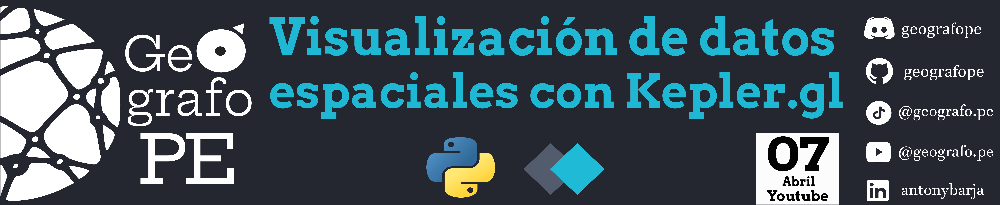

Este repositorio 🗂️ contiene un notebook📜 desarrollado en  que te permitirá realizar un análisis exploratorio visual de datos espaciales a traves de **Kepler.gl**, una herramienta open source basada en la web de alto rendimiento para la visualización de un gran conjuntos de datos georreferenciados. Está herramienta está construida sobre [GL MapLibre](https://maplibre.org/) y [deck.gl](https://deck.gl/).

Para este video usaremos las siguientes librerias: 👇
- **kepler.gl**: Librería que permite generar un análisis exploratorio visual de datos espaciales.
- pandas: Librería que permite crear, manipular y guardar dataframes.
- geopandas: Librería que permite manipular datos espaciales de tipo vector.
- ipyleaflet: Librería para trabajar mapas wen en jupyter notebook.

Todo el proceso desarrollado esta explicado paso a paso en el siguiente video de Youtube 🎥.

¡Enteráte más y aprender conmigo! 🔍💡 Suscríbete, activa las notificaciones 🔔 y únete a la comunidad que ama el software libre de codigo abierto. 🌟🌍 👇
-  https://www.youtube.com/@geografope

-  https://www.tiktok.com/@geografope

## 🔵 Referencias 
- *https://docs.kepler.gl/docs/keplergl-jupyter*
- *https://github.com/keplergl/kepler.gl*

